# React Trivia Quiz App

[This](https://trivia-quiz-app-s.netlify.app/) is trivia quiz application that allows users to log in, pick their preferred category, attempt a set of questions, and see their performance when the quiz ends.

## Table of contents

- [About](#about)
  - [Screenshots](#screenshots)
  - [Features](#features)
  - [Tech Stack](#tech-stack)
  - [Links](#links)
- [Author](#author)
- [Acknowledgments](#acknowledgments)

## About

### Screenshots

#### Desktop

    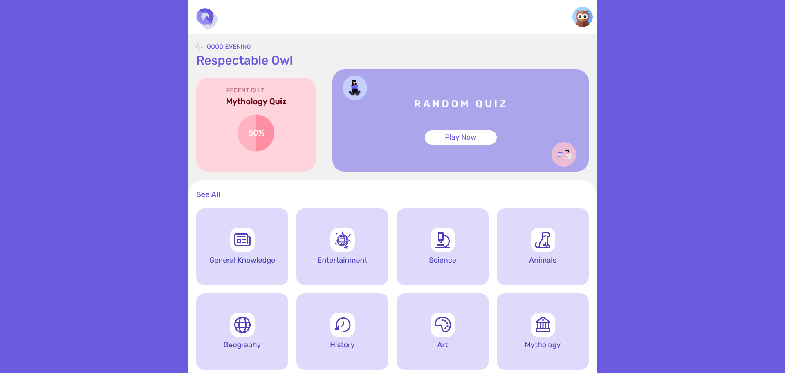

  
<strong>Full Desktop Gallery (click to expand)</strong>

   

  

    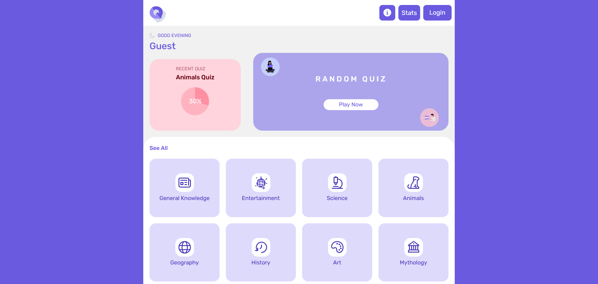
  

  

    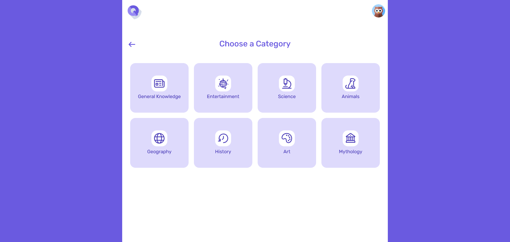
  

  

    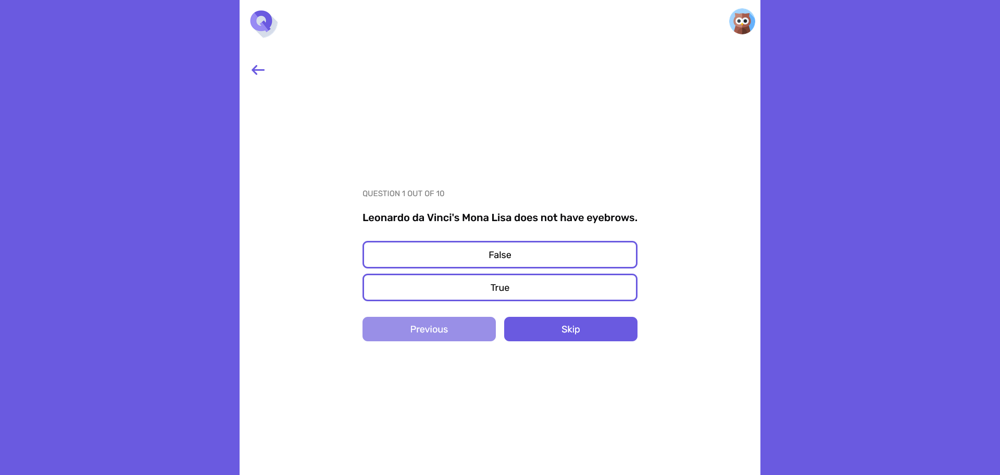
  

  

    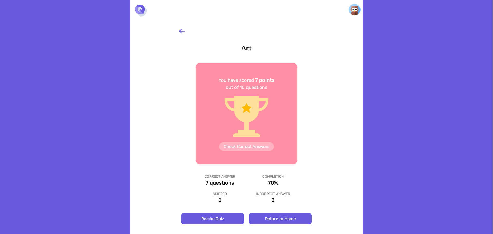
  

  

    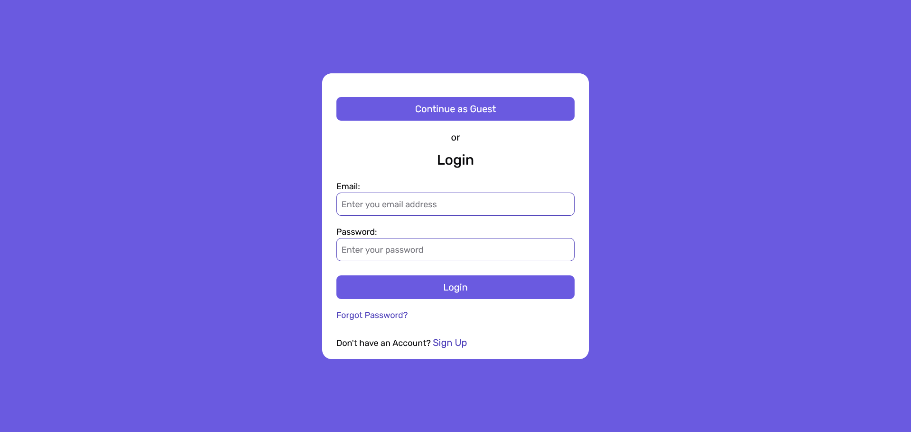
  

#### Mobile

  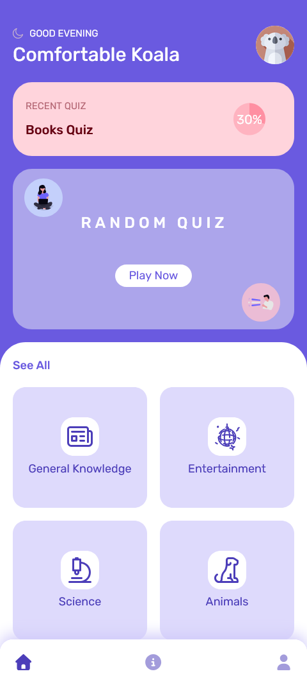
  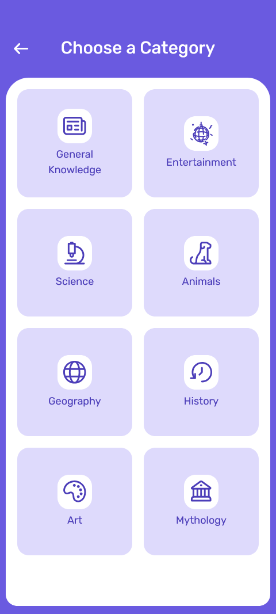
  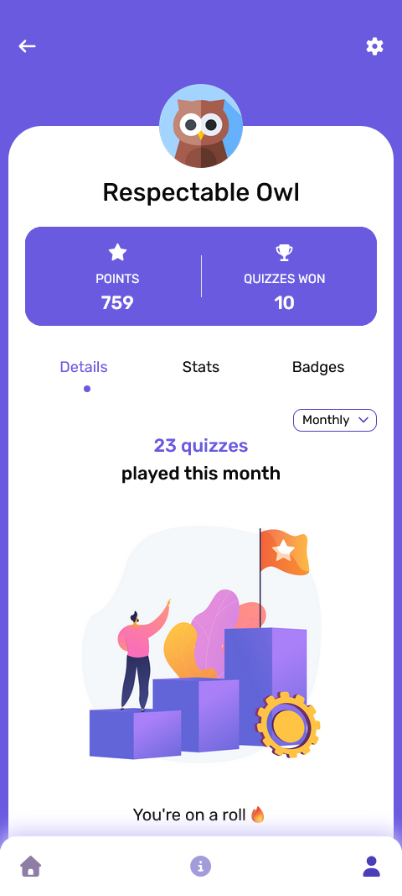

  
<strong>Full Mobile Gallery (click to expand)</strong>

   

  

    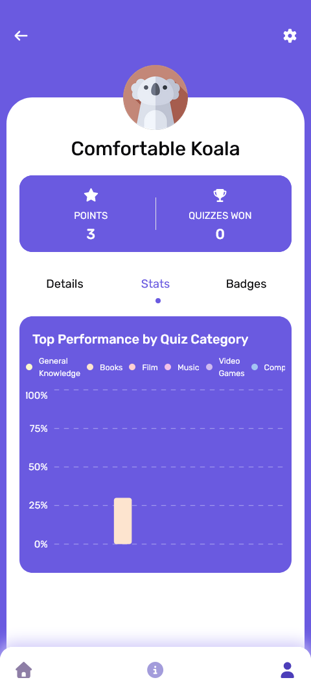
    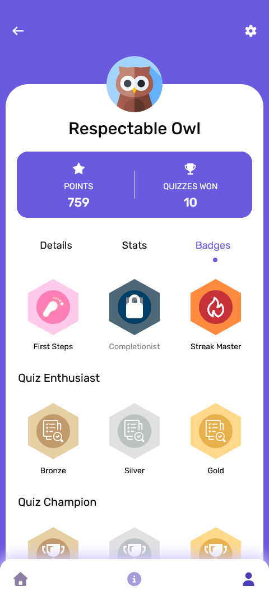
    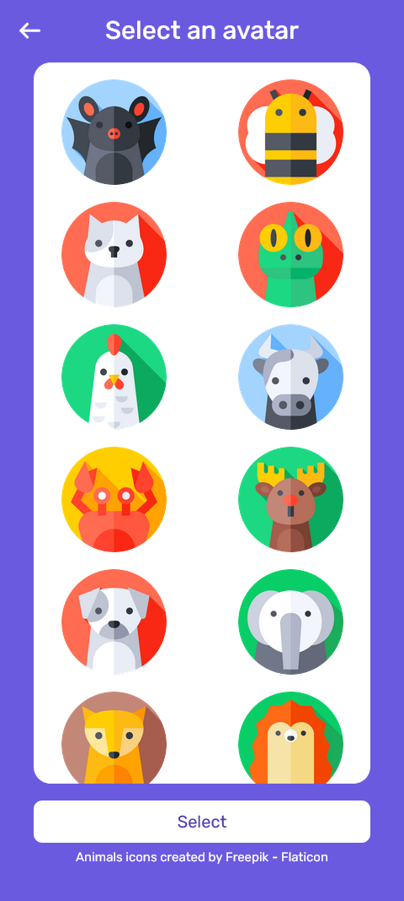
  

### Tech Stack

- React
- JavaScript
- Firebase
- Chakra UI
- Netlify

### Features

- **Multiple Quiz Categories**
  Fetched from the OpenTriviaDB API across various categories and subcategories.

- **Dynamic Quiz Generation**
  Each quiz session is generated with randomized questions.

- **Account Creation (Optional)**
  Users can either log in with email or continue as guests.

- **Progress Tracking**
  Quiz results are stored in Firestore, enabling:

  - Score history
  - Completion stats
  - Category-based performance
  - User badges (achievement system)

- **User Profile Page**
  Displays username, profile picture, stats, badges, and score charts.

- **Responsive UI**
  Built with Chakra UI + CSS Modules for clean mobile-first and desktop layouts.

- **Recent Quiz Card**
  Shows the most recently played quiz on the home page (based on stored data).

- **Random Quiz Generator**
  A dedicated card that instantly starts a random quiz from any category.

### Links

- Solution URL: [https://github.com/sruthi-nair166/Quiz-App](https://github.com/sruthi-nair166/Quiz-App)
- Live Site URL: [https://trivia-quiz-app-s.netlify.app/](https://trivia-quiz-app-s.netlify.app/)

## Author

- LinkedIn - [Sruthi V Nair](https://www.linkedin.com/in/sruthi-v-nair-5b5a09191/)
- Github - [Sruthi V Nair](https://github.com/sruthi-nair166)

## Acknowledgments

This app uses layout inspiration and free visual resources from the design community and asset libraries.  
All rights belong to their respective creators.

- **UI Layout Inspiration**

  - Illiyin Studio ([Figma](https://www.figma.com/community/file/1178996093139112052) & [Dribbble](https://dribbble.com/illiyinstudio))

- **User Avatars**

  - Freepik ([Flaticon](https://www.flaticon.com/authors/freepik))

- **Illustrations & Icons**
  - [Iconfinder](https://www.iconfinder.com/)
  - [Flaticon](https://www.flaticon.com/)
  - [Undraw](https://undraw.co/)
